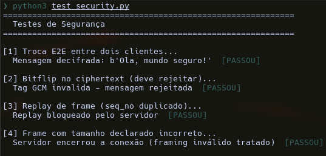

# Sistema de Mensageria Segura E2E
**Alunos:** Halyson Lima, João Victor Bráz

[github](https://github.com/cxrphly/seginfo-e2emsgr)

**Junho 2026**

## 1. Visão Geral
Sistema de mensageria multi-cliente com criptografia ponta-a-ponta (E2E). O servidor atua como relay opaco, nunca decifrando mensagens. Segurança baseada em handshake autenticado e derivação de chaves simétricas.

### Arquitetura

```
┌─────────┐      ┌─────────┐      ┌─────────┐
│ Cliente │      │ Servidor│      │ Cliente │
│    A    │─────>│  Relay  │─────>│    B    │
│         │<─────│ (Opaco) │<─────│         │
└─────────┘      └─────────┘      └─────────┘
     ↑                ↑                ↑
     └────────────────┴────────────────┘
              Conexões TCP
```


## 2. Conceitos de Segurança

### 2.1 Criptografia Assimétrica - RSA

**O que é**: Algoritmo baseado na dificuldade de fatorar números grandes. Usa par de chaves: pública (compartilhada) e privada (secreta).

**No Projeto**:
- Servidor gera par RSA 2048-bit (`gen_certs.py`)
- Usa chave privada para **assinar** o handshake (`server.py`)
- Cliente usa chave pública (via certificado) para **verificar** a assinatura (`client.py`)

```python
# server.py - Assinatura
sig = _SK_SERVER.sign(
    material,  # pk_server || pk_client || client_id || salt
    apd.PSS(...),  # RSA-PSS
    hashes.SHA256()
)

# client.py - Verificação
pk_server.verify(sig, material, apd.PSS(...), hashes.SHA256())
```

**Por que 2048 bits?** Segurança equivalente a 112 bits simétricos, recomendado até 2030.


### 2.2 RSA-PSS (Probabilistic Signature Scheme)

**O que é**: Esquema de assinatura digital com preenchimento probabilístico. Mais seguro que PKCS#1 v1.5.

**Características**:
- **Salt aleatório**: Mesmo documento tem assinaturas diferentes
- **Resistente a forjamento**: Provado seguro matematicamente
- **SHA-256**: Função hash usada

**No Projeto**:
```python
apd.PSS(
    mgf=apd.MGF1(hashes.SHA256()),  # MGF1 com SHA-256
    salt_length=apd.PSS.MAX_LENGTH,  # Salt máximo
)
```


### 2.3 Certificado X.509 e Pinagem

**O que é**: Documento digital que associa chave pública a uma identidade. Como um passaporte para chaves.

**Certificate Pinning**:
- Cliente tem cópia local do certificado
- Compara byte-a-byte com o recebido
- Não confia em CAs (Certificate Authorities)

**No Projeto**:
```python
# gen_certs.py - Cria certificado
cert = (
    x509.CertificateBuilder()
    .subject_name(subject)
    .public_key(sk.public_key())
    .sign(sk, hashes.SHA256())
)

# client.py - Pinagem
with open("server.crt", "rb") as f:
    pinned_pem = f.read()
if cert_pem != pinned_pem:
    raise ValueError("certificado não corresponde ao pinado!")
```

**Por que pinar?** MITM com certificado falso é impossível.


### 2.4 Criptografia de Curva Elíptica - X25519

**O que é**: Protocolo de troca de chaves Diffie-Hellman usando Curve25519.

**Vantagens**:
- Chaves de apenas **32 bytes**
- Operações **muito rápidas**
- **Resistente** a ataques de canal lateral

**Matemática**:
```math
Curve25519: y² = x³ + 486662x² + x (mod 2²⁵⁵ - 19)
```

```
Alice: sk_A (privada), pk_A = sk_A * G\n
Bob:   sk_B (privada), pk_B = sk_B * G\n
```

```
Alice: Z = sk_A * pk_B = sk_A * sk_B * G\n
Bob:   Z = sk_B * pk_A = sk_B * sk_A * G\n
```

**No Projeto**:
```python
# client.py - Geração de par efêmero
self.sk = X25519PrivateKey.generate()
self.pk = self.sk.public_key().public_bytes(
    serialization.Encoding.Raw,
    serialization.PublicFormat.Raw,
)  # 32 bytes raw

# client.py - ECDH
Z = sk.exchange(X25519PublicKey.from_public_bytes(pk_peer_bytes))
```


### 2.5 Forward Secrecy

**O que é**: Garantia de que, mesmo que a chave de longo prazo seja comprometida no futuro, mensagens passadas permanecem seguras.

**Como funciona**:
- Cada sessão gera **novo par X25519**
- Chave RSA é usada APENAS para autenticação
- Chaves simétricas são derivadas do segredo ECDH efêmero

**No Projeto**:
```python
# client.py - NOVO par a cada conexão
self.sk = X25519PrivateKey.generate()  # ← EFÊMERO!

# server.py - RSA é usado apenas para assinar
sig = _SK_SERVER.sign(material, ...)  # autenticação, não cifragem
```

**Analogia**: Caderno novo para cada conversa. Se um caderno for roubado, os outros continuam seguros.


### 2.6 ECDH (Elliptic Curve Diffie-Hellman)

**O que é**: Protocolo que permite duas partes estabelecerem um segredo compartilhado sem trocar chaves privadas.

**Propriedades**:
- **Seguro**: Atacante vê pk_A e pk_B mas não calcula Z
- **Eficiente**: Chaves curtas, operações rápidas
- **Forward Secrecy**: Quando usado com chaves efêmeras

**No Projeto**:
```python
# client.py
Z = sk.exchange(X25519PublicKey.from_public_bytes(pk_peer_bytes))
# Z é o segredo compartilhado (32 bytes)
# NUNCA transmitido ou logado
```


### 2.7 HKDF (Hash-based Key Derivation Function)

**O que é**: Algoritmo padronizado para derivar chaves criptográficas seguras.

**Duas Fases**:

**1. Extract**:
```
PRK = HMAC-SHA256(salt, IKM)
onde:
  IKM = Input Keying Material (segredo ECDH)
  salt = valor aleatório (16 bytes)
  PRK = Pseudo-random key (32 bytes)
```

**2. Expand**:
```
OKM = HMAC-SHA256(PRK, info || contador)
onde:
  OKM = Output Keying Material (chave derivada)
  info = contexto (ex: "A2B")
  contador = 0x01, 0x02, ...
```

**Por que HKDF?**
- **Extract**: Remove padrões indesejados do segredo ECDH
- **Expand**: Permite derivar MÚLTIPLAS chaves do mesmo segredo
- **Salt**: Adiciona entropia e isola diferentes contextos
- **Info**: Separa chaves para diferentes propósitos

**No Projeto**:
```python
def _derive_e2e_keys(my_id, peer_id, sk, pk_peer_bytes, my_salt, peer_salt):
    # Extract
    Z = sk.exchange(X25519PublicKey.from_public_bytes(pk_peer_bytes))
    
    # Expand (duas chaves diferentes)
    key_send = HKDF(hashes.SHA256(), 16, my_salt, b"A2B").derive(Z)
    key_recv = HKDF(hashes.SHA256(), 16, peer_salt, b"B2A").derive(Z)
    
    return key_send, key_recv
```


### 2.8 AES-GCM (Galois/Counter Mode)

**O que é**: Modo de operação do AES que fornece AEAD (Authenticated Encryption with Associated Data).

**O que AEAD fornece**:
- **Confidencialidade**: Cifragem
- **Integridade**: Tag de autenticação
- **Autenticidade**: Verificação da tag

**Como funciona**:

**Cifração**:
```
1. Counter = Nonce || 0x00000001
2. Keystream = AES(key, Counter)
3. Ciphertext = Plaintext XOR Keystream
4. Tag = GHASH(AAD, Ciphertext, len(AAD), len(Ciphertext))
5. Output = Ciphertext || Tag
```

**Decifração**:
```
1. Recalcula Tag = GHASH(AAD, Ciphertext, ...)
2. Se Tag != Tag_recebida -> REJEITA (integridade violada)
3. Counter = Nonce || 0x00000001
4. Keystream = AES(key, Counter)
5. Plaintext = Ciphertext XOR Keystream
```

**No Projeto**:
```python
# client.py - Cifração
ct = AESGCM(key).encrypt(nonce, plaintext, aad)
# Retorna: ciphertext + tag (16 bytes)

# client.py - Decifração
plaintext = AESGCM(key).decrypt(nonce, ciphertext, aad)
# Lança exceção se tag for inválida
```

**Por que AES-128-GCM?**
- **AEAD**: Confidencialidade + Integridade em uma passagem
- **Alta performance**: Pode ser acelerado por hardware (AES-NI)
- **Tag de 16 bytes**: Segurança adequada


### 2.9 Nonce (Number Used Once)

**O que é**: Valor usado apenas uma vez com uma determinada chave. Em AES-GCM, o nonce deve ser **único** para cada mensagem.

**Por que o nonce é crítico?**
- Se o mesmo nonce for reutilizado:
  1. Tag GCM pode ser forjada
  2. Keystream é reutilizado (XOR entre cifras)
  3. Atacante pode recuperar o plaintext

**Construção do Nonce no Projeto**:
```
Nonce (12 bytes) = IV_base (4 bytes) || seq_no (8 bytes)

IV_base: aleatório (gerado uma vez por direção/sessão)
seq_no: contador monotônico (incrementa a cada mensagem)
```

**Garantia de Unicidade**:
- `IV_base` (4B) = 2^32 possibilidades
- `seq_no` (8B) = 2^64 possibilidades
- Combinação praticamente única

**No Projeto**:
```python
# client.py
iv_base = os.urandom(4)  # 4 bytes aleatórios
seq_bytes = struct.pack(">Q", seq_no)  # 8 bytes big-endian
nonce = iv_base + seq_bytes  # 12 bytes
```


### 2.10 AAD (Additional Authenticated Data)

**O que é**: Dados que NÃO são cifrados, mas são AUTENTICADOS. Protege metadados contra adulteração.

**No Projeto**:
```python
aad = sender_id + recipient_id + seq_bytes
```
- `sender_id`: Garante que remetente não seja falsificado
- `recipient_id`: Garante que mensagem não seja redirecionada
- `seq_no`: Garante ordem (anti-replay)

**Por que AAD é importante?**
- Atacante não pode alterar metadados sem detecção
- GCM verifica integridade do AAD junto com o ciphertext


### 2.11 Anti-Replay com Seq_No

**O que é**: Prevenção contra ataques onde atacante grava e reenvia mensagens legítimas.

**Mecanismo**:
- Cada mensagem tem `seq_no` monotônico (0, 1, 2, ...)
- Receptores mantêm `last_seq` (último aceito)
- Mensagem com `seq_no <= last_seq` é REJEITADA

**Dupla Camada**:
1. **Servidor**: Descarta frames com `seq_no <= sess["seq_recv"]`
2. **Cliente**: Descarta mensagens com `seq_no <= peer["seq_recv"]`

**No Projeto**:
```python
# server.py
if seq_no <= sess["seq_recv"]:
    log.warning(f"replay detectado: seq={seq_no}")
    continue  # descarta
sess["seq_recv"] = seq_no

# client.py
if seq_no <= last_seq:
    raise ValueError(f"replay detectado: seq={seq_no}")
peer["seq_recv"] = seq_no
```


### 2.12 UUID (Universally Unique Identifier)

**O que é**: Identificador de 128 bits (16 bytes) praticamente único no mundo.

**Características**:
- **UUID v4**: Baseado em números aleatórios
- **122 bits de entropia**: ~5.3 x 10^36 possibilidades
- **Sem coordenação central**: Gerado localmente

**No Projeto**:
```python
# client.py
self.client_id: bytes = uuid.uuid4().bytes  # 16 bytes

# Uso:
# - Identificar clientes
# - Ordenação lexicográfica (quem é A/B)
# - AAD no AES-GCM
```

**Por que UUID?** Simples, único, sem necessidade de servidor central.


### 2.13 Ordenação Lexicográfica para Derivação

**O que é**: Método determinístico para que ambos os lados cheguem ao mesmo par de chaves.

**Problema**: Alice e Bob precisam saber quem é A e quem é B para usar os labels corretos.

**Solução**: Comparar `client_id` lexicograficamente.
- Menor ID = A
- Maior ID = B

**No Projeto**:
```python
is_A = my_id < peer_id  # comparação lexicográfica

send_info = b"A2B" if is_A else b"B2A"
recv_info = b"B2A" if is_A else b"A2B"
```

**Exemplo**:
```
Alice: ID = 0x1234... (menor) -> é A
Bob:   ID = 0x5678... (maior)  -> é B

Alice: key_send = A2B, key_recv = B2A
Bob:   key_send = B2A, key_recv = A2B
```

**Por que isso funciona?** Ambos usam a MESMA regra de ordenação, então concordam.


### 2.14 Salt Criptográfico

**O que é**: Valor aleatório adicionado para garantir que mesmo inputs idênticos produzam outputs diferentes.

**Função no HKDF**:
- **Isolamento de direções**: `my_salt` para A->B, `peer_salt` para B->A
- **Proteção contra pré-computação**: Mesmo Z, salts diferentes -> chaves diferentes
- **Entropia adicional**: Aumenta segurança da derivação

**No Projeto**:
```python
# server.py - Gera salt aleatório por handshake
salt_srv = os.urandom(16)

# client.py - Usa salts diferentes para cada direção
key_send = HKDF(..., my_salt, ...).derive(Z)
key_recv = HKDF(..., peer_salt, ...).derive(Z)
```

**Analogia**: Mesma receita (ECDH) mas ingredientes diferentes (salts) -> bolos diferentes (chaves).


### 2.15 Framing TCP

**O que é**: Protocolo para delimitar mensagens em um fluxo TCP contínuo.

**Problema**: TCP é um fluxo de bytes, não preserva limites de mensagem.

**Solução**: Prefixar cada frame com 4 bytes indicando o tamanho.

**Estrutura**:
```
┌─────────────────────────────────────────────┐
│  4 bytes: tamanho total do frame (N)       │
├─────────────────────────────────────────────┤
│  1 byte: tipo do frame (HANDSHAKE, E2E...) │
├─────────────────────────────────────────────┤
│  N-1 bytes: payload do frame               │
└─────────────────────────────────────────────┘
```

**No Projeto**:
```python
def build_frame(msg_type: int, payload: bytes) -> bytes:
    body = bytes([msg_type]) + payload
    return struct.pack(">I", len(body)) + body

async def read_frame(reader: asyncio.StreamReader) -> bytes:
    hdr = await reader.readexactly(4)  # le tamanho
    n = struct.unpack(">I", hdr)[0]
    if n > MAX_FRAME:
        raise ValueError(f"frame muito grande: {n}")
    return await reader.readexactly(n)  # le payload
```


### 2.16 AEAD (Authenticated Encryption with Associated Data)

**O que é**: Modo de criptografia que fornece confidencialidade, integridade e autenticidade simultaneamente.

**Componentes**:
```
Entrada: key, nonce, plaintext, aad
Saída: ciphertext + tag

Decifração:
- Verifica tag (integridade)
- Se ok, decifra (confidencialidade)
- AAD também é verificado (autenticidade)
```

**No Projeto** (AES-GCM):
```python
# AAD protege metadados
aad = sender_id + recipient_id + seq_bytes

# Cifragem
ct = AESGCM(key).encrypt(nonce, plaintext, aad)

# Decifração (verifica tag automaticamente)
plaintext = AESGCM(key).decrypt(nonce, ciphertext, aad)
```

**Por que AEAD é importante?** Uma única operação garante múltiplas propriedades de segurança.


### 2.17 SHA-256 (Secure Hash Algorithm 256-bit)

**O que é**: Função hash criptográfica que produz 256 bits (32 bytes).

**Propriedades**:
- **Determinística**: Mesma entrada -> mesma saída
- **Irreversível**: Não é possível recuperar a entrada
- **Resistência a colisão**: Difícil encontrar duas entradas com mesmo hash
- **Efeito avalanche**: Pequena mudança -> grande mudança na saída

**No Projeto**:
```python
# HKDF
HKDF(hashes.SHA256(), ...)

# RSA-PSS
apd.PSS(mgf=apd.MGF1(hashes.SHA256()))

# Certificado
cert.sign(sk, hashes.SHA256())
```


### 2.18 Tipo de Frame E2E

**Estrutura**:
```
┌──────────┬──────────┬───────────┬──────────┬──────────────────┐
│  nonce   │ sender   │ recipient │  seq_no  │ ciphertext + tag │
│  (12B)   │  (16B)   │  (16B)    │  (8B)    │     (var)        │
└──────────┴──────────┴───────────┴──────────┴──────────────────┘
```

**Campos**:
| Campo | Tamanho | Descrição |
|-------|---------|-----------|
| nonce | 12B | IV_base (4B) \|\| seq_no (8B) |
| sender | 16B | UUID do remetente |
| recipient | 16B | UUID do destinatário |
| seq_no | 8B | Contador monotônico (big-endian) |
| ciphertext+tag | var | Dados cifrados + tag GCM (16B) |

**AAD** = `sender_id || recipient_id || seq_no`


## 3. Estrutura do Projeto

```
tp3-mensageria/
│
├── gen_certs.py          # Gera certificados RSA do servidor
│   └── RSA 2048-bit + X.509 autoassinado
│
├── server.py             # Servidor relay
│   ├── Handshake RSA-PSS
│   ├── Distribuição de chaves X25519
│   ├── Relay de mensagens E2E
│   └── Anti-replay
│
├── client.py             # Cliente interativo
│   ├── X25519 (ECDHE)
│   ├── HKDF-SHA256
│   ├── AES-128-GCM
│   └── Interface de linha de comando
│
├── test_security.py      # Testes automatizados
│   ├── Troca E2E
│   ├── Bitflip
│   ├── Replay
│   └── Framing inválido
│
├── decode.py             # Debug de frames
├── requirements.txt      # cryptography>=41.0.0
├── server_private.pem    # Chave privada RSA (gerado)
└── server.crt           # Certificado do servidor (gerado)
```

## 4. Testes

### Resumo dos Testes

| Teste | Objetivo | Resultado Esperado |
|-------|----------|-------------------|
| **Troca E2E** | Validar cifragem/decifragem | Mensagem decifrada corretamente |
| **Bitflip** | Validar integridade (tag GCM) | Exceção lançada |
| **Replay** | Validar anti-replay | Mensagem rejeitada |
| **Framing** | Validar robustez | Servidor desconecta |

### Execução

```bash
python3 test_security.py
```

### Saída Esperada



## 5. Como Executar

### Pré-requisitos

```bash
pip install -r requirements.txt
```

### Passos

```bash
# 1. Gerar certificados (UMA VEZ)
python3 gen_certs.py

# 2. Iniciar servidor (Terminal 1)
python3 server.py

# 3. Conectar Cliente A (Terminal 2)
python3 client.py

# 4. Conectar Cliente B (Terminal 3)
python3 client.py

# 5. Executar testes (servidor ativo)
python3 test_security.py
```

### Comandos do Cliente

| Comando | Descrição |
|---------|-----------|
| `list` | Lista peers conectados |
| `@N <msg>` | Envia para peer de índice N |
| `<msg>` | Envia para único peer (atalho) |
| `quit` | Encerra conexão |


## Resumo de Garantias

| Propriedade | Mecanismo | Código |
|-------------|-----------|--------|
| Confidencialidade | AES-128-GCM | `AESGCM(key).encrypt()` |
| Integridade | Tag GCM (16B) | `AESGCM(key).decrypt()` |
| Autenticidade | RSA-PSS + Cert | `pk_server.verify()` |
| Forward Secrecy | X25519 ECDHE | `X25519PrivateKey.generate()` |
| Anti-Replay | Seq_no monotônico | `if seq_no <= last_seq` |
| Servidor Cego | Relay opaco | `dest.write(E2E, payload)` |

## Conceitos

| Conceito | gen_certs.py | server.py | client.py | test_security.py |
|----------|--------------|-----------|-----------|------------------|
| RSA 2048-bit |  Gera |  Assina |  Verifica |  Valida |
| Certificado X.509 |  Cria |  Envia |  Pinado |  Pinado |
| RSA-PSS | - |  Assina |  Verifica |  Verifica |
| X25519 ECDHE | - |  Distribui |  Gera |  Gera |
| Forward Secrecy | - | - |  Efêmero |  Efêmero |
| HKDF-SHA256 | - | - |  Deriva |  Deriva |
| AES-128-GCM | - | - |  encrypt/decrypt |  encrypt/decrypt |
| Nonce IV_base||seq | - | - |  4B+8B |  4B+8B |
| AAD | - | - |  sender||recipient||seq |  sender||recipient||seq |
| Anti-Replay | - |  Verifica |  Verifica |  Testa |
| UUID v4 | - | - |  Gera |  Gera |
| Framing TCP | - |  4B prefix |  4B prefix |  4B prefix |
